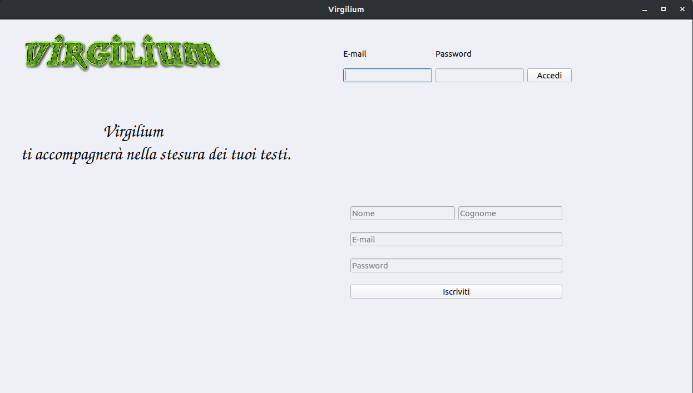
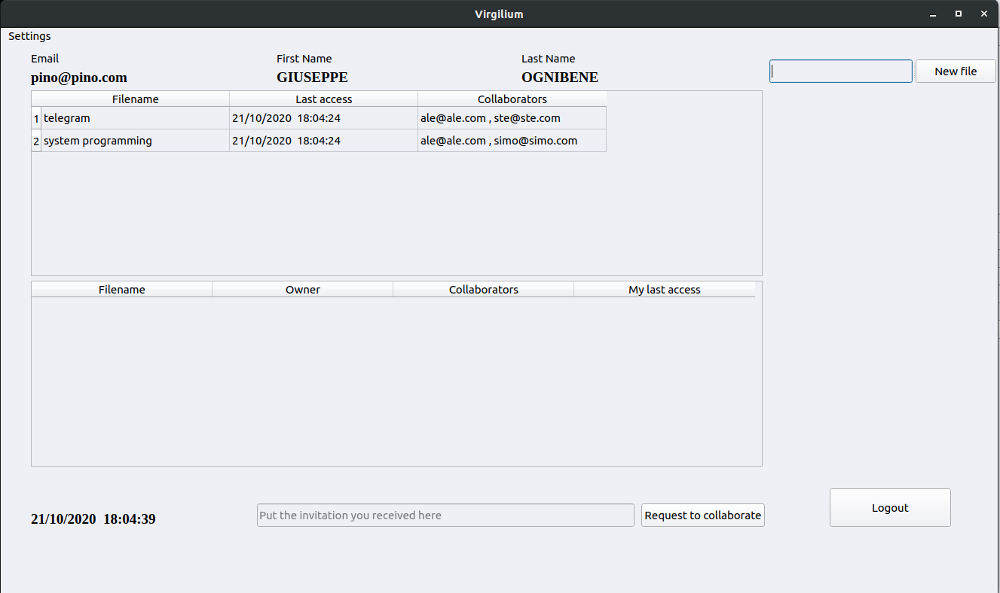
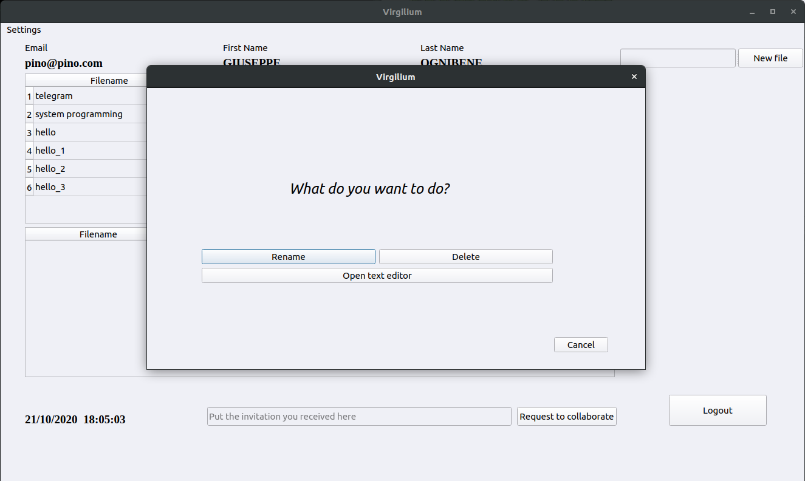
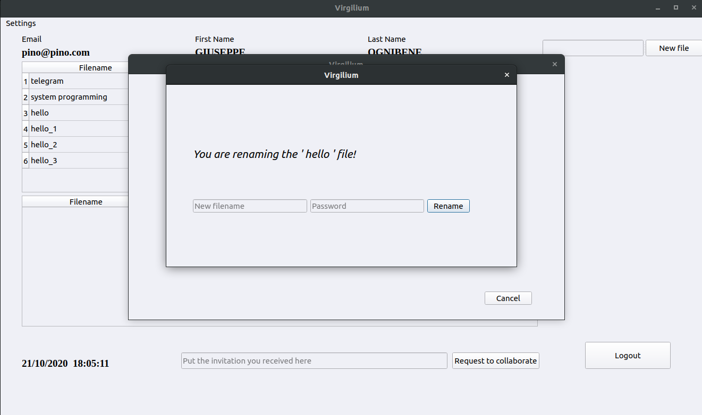
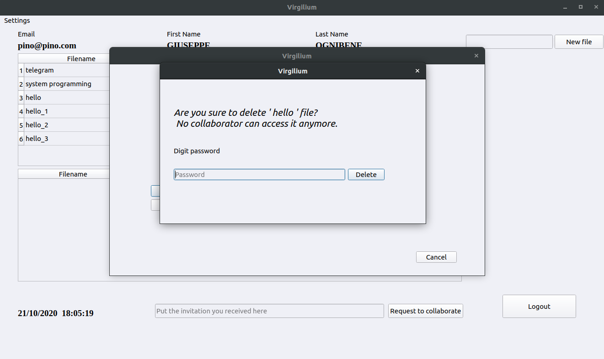
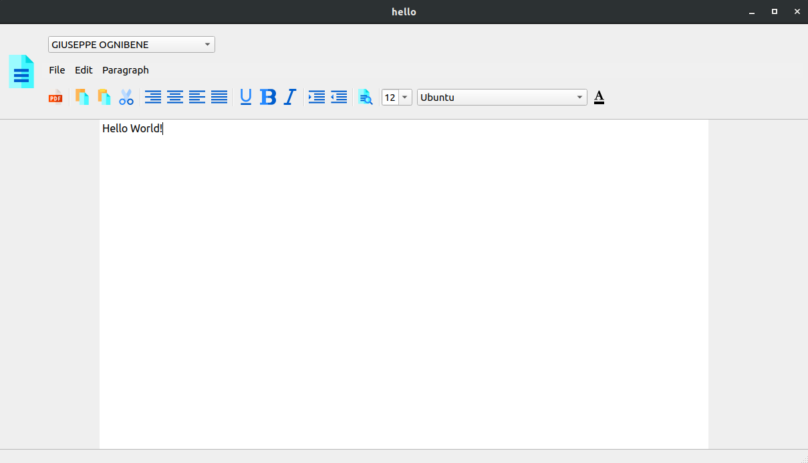
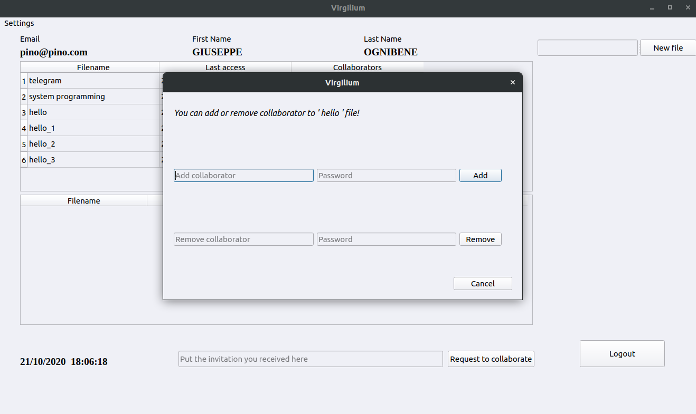
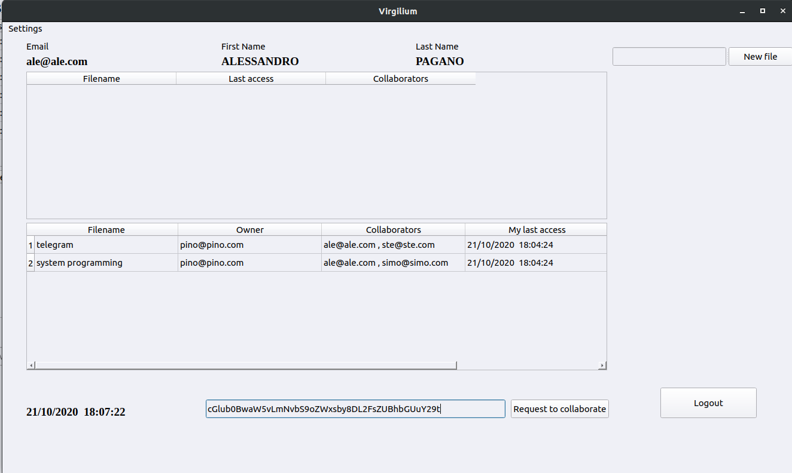
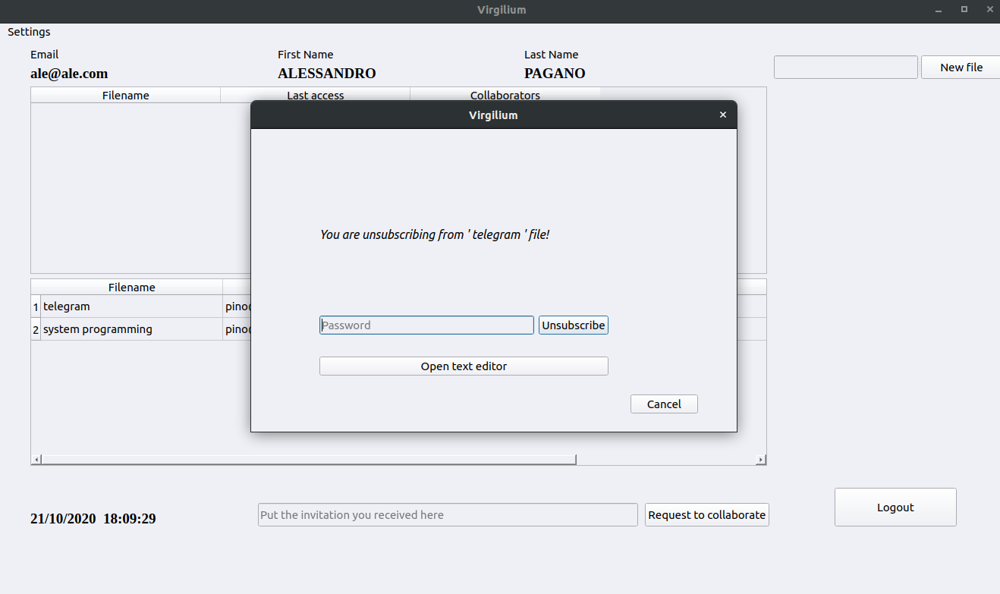

# Virgilium

This is the project of the System adn Device Programming course of the year 2018/2019. In short, a real-time text editor based on the CRDT algorithm, developed using Qt (5.12.3).

The following describes first a list of the functions that are offered and then moves on to an overview of the project structure and algorithmic choices.

If you want to use VirgiliumEditor, these are the libraries to install on your device:
* Qt (at least from version 5.12.3)
* sqlite3


To launch the server:
```
./VirgiliumServer
```

To launch the client:
```
./VirgiliumClient [ip address]
```

## TESTDB

In the constants.h file there is a constant TESTDB which if set to true, every time the server is launched,
recreates the users and test files.

## Test users

These are the 4 users already present with their respective passwords:

* ale@ale.com, ale
* pino@pino.com, pino
* simo@simo.com, simo
* ste@ste.com, ste

## Welcome page

* Ability to log in with the user's email and password
* Ability to register by entering name, surname, email and password

## Personal page

* Information on the logged in user: name, surname, email
* The first table shows the files of which the logged in user is the owner or the creator. The columns of the table are: file name, last access and list of collaborators (indicated by their emails)
    * By clicking on the filename name it is possible to perform 3 actions:
        * Rename the file, after entering the password
        * Delete the file after entering the password
        * Open the text editor. When the text editor is closed, the last access is updated.
    * By clicking on the list of collaborators it is possible to perform 2 actions:
        * Add a collaborator by creating an invitation (after entering the password) which will then be sent through third parties to the user you want to add as a collaborator and who will agree to collaborate if he wishes. The code is valid for 24 hours.
        * Remove a collaborator, after entering the password
* The second table shows the files to which the logged in user collaborates. The columns of the table are: file name, owner, list of collaborators and last access to the file by the user
    * By clicking on any column of a file it is possible to perform 2 actions:
        * Unsubscribe as a contributor to a file
        * Open the text editor. When the text editor is closed, the last access is updated.
* In the central part at the bottom, there is the possibility to insert an invitation (code) received for third parties by another user and then to accept the collaboration with a particular file. The code is valid for 24 hours.
* At the bottom right is the logout button. By pressing, you return to the welcome page.
* At the top right you can create a new file. It is possible to create files with the same name, the name will be automatically modified by adding a "_" and a number in the case of homonymy, for example "filename_2"
* Top left you can:
    * change theme: default and light mode
    * change password
    

## Text editor

* At the top left you can see the users who are currently editing the file, each of these is assigned a color with which it is possible to distinguish the different cursors within the worksheet.
* At the top of the page there are several actions that can be performed, most of these can be activated both from the menu and using the appropriate icons, among the most important we have
   * creating a PDF file with the content of the document
   * copy, cut and paste operations
   * alignment and indentation
   * the ability to change the text to italic, bold or underline
   * the option to replace all occurrences of one or more words with others
   * actions to change the font, the size of the text and also its color
* Finally, in the central part of the window there is a sheet available where you can insert everything that will be part of the currently edited document.


# Project's structure

The project is divided into 3 directories:
* client: there are all the .h/.cpp/.ui files that represent the client views and the **clientStuff** class that deals with the management of everything related to client and server, using the **ClientSocket class**.
* server: the **server** class is present which is the one that, using the **ClientSocket** class, takes care of managing the client-server connection and that uses the **model** class that takes care of various things between which database management, using
 the **database** class.
* common: As you can guess from the name, this folder holds all the files that are shared between client and server.
    * In the common directory there are: the file **constants.h** where all the constants used are defined; **User (.h/.cpp)** representing a user and being used
    within the client or server; **ClientSocket (.h/.cpp)** which will be explained in the **Client and server communication management** section
    * Then there are two directories **CRDT** and **messages** where there are respectively the files that are used to implement the CRDT algorithm and the files or the classes
    which represent the wrappers of the messages that are exchanged between client and server
    
    
# CRDT algorithm
The CRDT algorithm was used for the implementation of the application logic, for more information you can click [here] (https://conclave-team.github.io/conclave-site/#what-is-a- real-time-collaborative-text-editor).
In particular, various functions have been implemented with the aim of collecting all the changes within the editor of a client in such a way as to transmit this information to the server, which has the purpose of distributing the data to the other interested clients. As described by the algorithm, the effort was to obtain in all cases a consistent situation in the different clients, obtained by making the insertion operation commutative and the cancellation operation, as well as commutative, also idempotent. Specifically, switchability and idempotence were obtained by adding to the basic properties of the object (value, position) properties such as siteID (client identification) and counterID (progressive number associated with the character and assigned by the client). Precisely for this reason two fundamental aspects are those relating to the absolute position of a single character and its format.

# Threading
Since most of the operations in the application are quite fast, it was decided to minimize the use of threads. The only case in which a thread pool was used was that related to saving a file, in particular, after having calculated the correct position of the single character, one of the available threads is used to perform the saving.

# File system management

* To manage the file system, it was decided to create a folder for each user using the user's email and within the folder save the files owned by the user.
* If a user collaborates on a file, the opening of the file is done using the database.

# Database management

* Sqlite3 was used for database management
* 4 tables have been created:
    * files: id, filename, email_owner
    * users: email, firstname, lastname, password (with hash)
    * user_files: id, email, last_access
    * invitation_urls: url, id, timeout

# Client and server communication management

Communication between client and server takes place through the exchange of different types of messages.
Each of these messages is identified by an identification code that specifies the action to be performed, followed by the content of the actual message.
In the **ClientSocket** class, the central role is played by the onReadyRead function. This slot is called whenever data is available to be read. As soon as this occurs, a signal is issued to the target client or server. In this same class are also defined other methods that specify the sending of the various messages. Since the functions performed by this class are common to both the server and the client, the class itself is shared.
In this sense, other classes are also in common: in particular those relating to the definition of messages and the file constants.h where the constants used in the program are listed, including the identification codes.


# Some screens


















